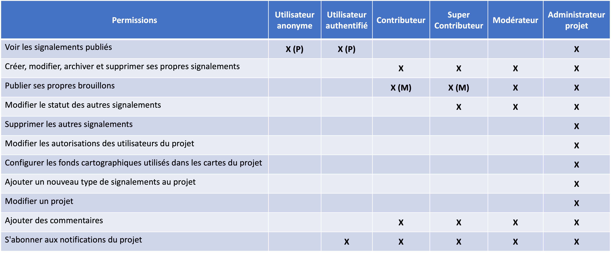
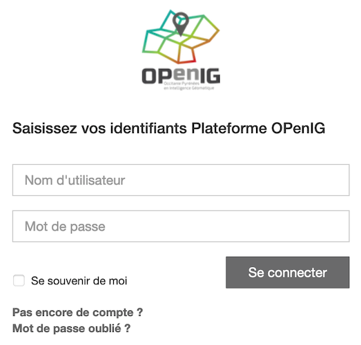
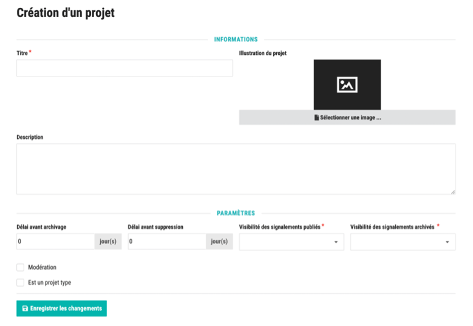
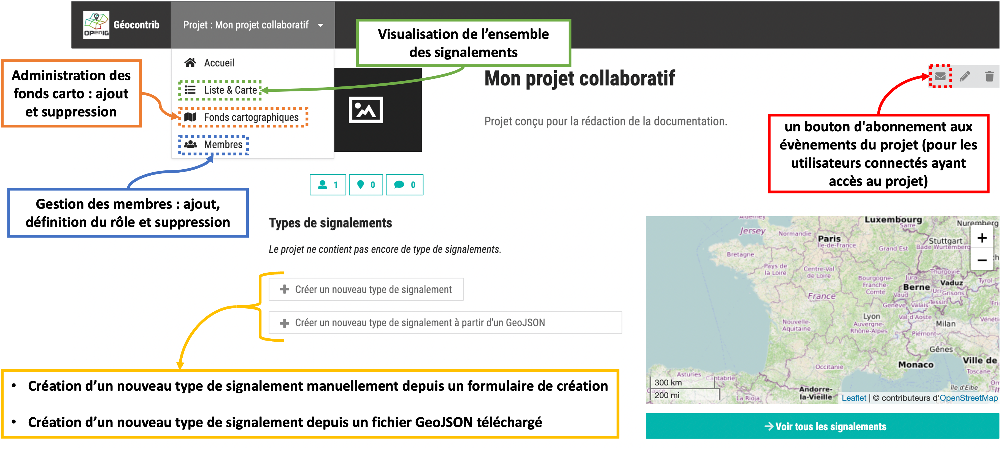

====================
Application Géocontrib
====================

GéoContrib est une application web destinée à éditer de manière collaborative une base de données sous la forme de contributions géolocalisées et de commentaires. En utilisant un système de commentaires, de notifications et de modération des contributions elle cherche à renforcer des communautés d'utilisateurs autour de projets de constitution ou de qualification de leurs bases de données géographiques.

Elle a été conçue pour fonctionner aussi bien sur du matériel sédentaire que sur des terminaux mobiles (dans des navigateurs internet modernes).

Accès : https://geocontrib.openig.org/geocontrib/

-----------------------------------------------------------------------------
Utilisateurs et autorisations
-----------------------------------------------------------------------------

Il faut distinguer les rôles définis pour toute l'application (super admin), des rôles définis pour un projet (utilisateur connecté, contributeur, modérateur, administrateur projet) :

* **Utilisateur anonyme :** indique que l'utilisateur courant n'est pas connecté.
* **Utilisateur connecté :** indique que l'utilisateur est connecté mais n'a pas d'autorisation spécifique sur ce projet. Il peut seulement s’abonner aux notifications du projet.
* **Contributeur :** indique que l'utilisateur peut saisir des signalements et écrire des commentaires dans les projets où il est défini comme contributeur.
* **Super Contributeur :** il a les mêmes droits qu'un contributeur, mais il peut interagir avec les contributions des autres utilisateurs comme s'il s'agissait de ses propres contributions, sauf en ce qui concerne la suppression : il ne peut supprimer que les signalements dont il est l'auteur.
* **Modérateur :** il a les droits d'un contributeur ainsi que des droits supplémentaires. Un utilisateur peut devenir modérateur d'un projet uniquement si le projet est modéré.
* **Administrateur projet :** indique que l'utilisateur peut administrer le projet, à savoir modifier les paramètres du projet, créer des nouveaux types de signalements, paramétrer les fonds cartographiques et administrer les niveaux d'autorisation des autres utilisateurs sur ce projet. Par défaut, lorsqu'un utilisateur créé un nouveau projet, son rôle est "Administrateur projet".
* **Super Admin :** tous les droits (correspond à l’équipe d’OPenIG).

(P) : dépend des caractéristiques du projets, notamment du paramètre "Visibilité des signalements publiés"
(M) : dépend si le projet est modéré ou non. S'il est modéré :

* le contributeur ne peut pas publier ses brouillons mais les mettre en "publication en cours"
* le contributeur ne peut pas archiver ses propres signalements, même si la visibilité lui est accordé
* le modérateur peut modifier tous les signalements qui ont le statut "en publication en cours", "publiés" (ou "archivés" selon les caractéristiques du projet (P)) vers les statuts "brouillon", "publiés" (et "archivés" selon les caractéristiques du projet (P)).

-----------------------------------------------------------------------------
Identification
-----------------------------------------------------------------------------

L'identification se fait avec vos identifiants OPenIG.

Une fois connecté, 2 options selon vos droits :

* Créer un nouveau projet
* Accéder à un projet déjà créé afin d’y contribuer

-----------------------------------------------------------------------------
Création d'un projet
-----------------------------------------------------------------------------

Il faut remplir ici les éléments permettant de décrire votre projet : titre (obligatoire), description, imagette, délai avant archivage, délai avant suppression, visibilité des signalements publiés (obligatoire) et visibilité des signalements archivés (obligatoire).

Case à cocher "Modération" : dans le cas de projets modérés, les contributeurs ne peuvent pas publier directement leurs signalements. Ceux-ci doivent d'abord être évalués par des utilisateurs dits modérateurs du projet (ou par les administrateurs du projet). Si la modération est choisie, le rôle de "Modérateur" est alors disponible (attribuable par l’administrateur du projet).

Case à cocher "Est un projet type" : lors de la création d’un nouveau projet, il est possible d’utiliser un modèle. C’est cette case qui permet de définir si ce projet est oui ou non un projet modèle qui pourra être réutilisé par d’autres utilisateurs. Les champs caractéristiques du nouveau projet sont alors préremplis avec les mêmes valeurs que celles du projet modèle. Les champs sont tous éditables.

-----------------------------------------------------------------------------
Paramétrage du projet et des signalements
-----------------------------------------------------------------------------

Une fois sur le projet créé, vous allez pouvoir le paramétrer plus en détail : création de types de signalement, gestion des fonds de carte, des membres, etc.

^^^^^^^^^^^^^^^^^^^^^^^^^^^^^^^^^^^^^^^^^^^^^^^^^^
Création de type de signalements
^^^^^^^^^^^^^^^^^^^^^^^^^^^^^^^^^^^^^^^^^^^^^^^^^^

* **A partir du formulaire**

Les administrateurs d'un projet (et utilisateur de niveau de permission supérieur) ont la possibilité d'ajouter un type de signalement ou d'éditer un type de signalement (tant qu'aucun signalement n'est créé pour ce type).

Le formulaire permet de définir un titre pour le type de signalement, une géométrie ainsi que des champs personnalisés :
	Booléen (case à cocher)
	Chaîne de caractères
	Date (format jj/mm/aaaa)
	Liste de valeurs : Il faut indiquer les valeurs en les séparant par une virgule. Ce champ prend la forme d’une liste déroulante avec un choix possible entre les valeurs renseignées.
	Nombre entier
	Nombre décimal
	Texte multiligne

* **Paramétrage du style**

Lors de la création du champ personnalisé, il est possible d'affecter une couleur à chacune des valeurs de la liste de valeurs. Pour ce faire, il faut d'abord définir le champ personnalisé.

	Pour les types de signalements linéaires ou polygones, un menu déroulant apparaît en haut de la page d'édition du type de signalement. Dans ce menu déroulant, sélectionner le champ personnalisé correspondant à la liste de valeurs. Devant chaque valeur de la liste apparaît alors un cadre permettant de modifier la couleur affectée à chaque valeur. Il n'est pas possible de personnaliser les couleurs pour plus d'une liste de valeurs. Le signalement prendra alors la couleur de la valeur à laquelle il est associé.

	Pour les types de signalements ponctuels, le style (symbole et/ou couleur) peut être défini depuis la page d'accueil du projet, en cliquant sur le bouton "Editer la symbologie du type de signalement". Une nouvelle page permet de définir une couleur et un symbole par défaut, ou de sélectionner dans une liste de choix un des champs de type liste (s'il en existe pour ce type de signalements). Il est alors possible de définir une couleur et un symbole pour chaque valeur de la liste.

* **A partir d'un GeoJSON**

Depuis la page d'accueil d'un projet, le bouton "Créer un type de signalements à partir d'un fichier GeoJSON" permet à l'utilisateur d’importer un fichier local. La structure du fichier va être automatiquement lue et le modèle de données du type de signalement est proposé à l'utilisateur à travers le formulaire d'édition. L'administrateur peut modifier, préciser et vérifier la géométrie, le titre du type de signalement et chacun des champs personnalisés.

En bas de page, il peut choisir :

-	de créer simplement le type de signalement

-	de créer le type de signalement et d'importer les données du fichier

^^^^^^^^^^^^^^^^^^^^^^^^^^^^^^^^^^^^^^^^^^^^^^^^^^
Administration des fonds cartographiques
^^^^^^^^^^^^^^^^^^^^^^^^^^^^^^^^^^^^^^^^^^^^^^^^^^

L’administrateur projet a la possibilité d’ajouter ou supprimer des fonds cartographiques parmi une liste de couche.

Au besoin d’avoir d’autres fonds cartographiques, il n’y a que les Super Admin (soit l’équipe d’OPenIG) qui peuvent le faire. Merci de nous adresser votre demande et nous essayerons de répondre à votre besoin.

^^^^^^^^^^^^^^^^^^^^^^^^^^^^^^^^^^^^^^^^^^^^^^^^^^
Gestion des membres
^^^^^^^^^^^^^^^^^^^^^^^^^^^^^^^^^^^^^^^^^^^^^^^^^^

L’administrateur projet a la possibilité de rajouter des membres au projet parmi une liste déroulante. Pour chaque membre, un rôle lui est attribué en fonction du niveau d’autorisation défini dans les paramètres du projet.

Pour ce qui concerne les niveaux d’autorisation, vous trouverez des informations ici : ….

.. note:: **Les membres présents dans cette liste déroulante correspondent à des comptes qui se sont au moins connectés une fois sur l’application Geocontrib avec leur compte OPenIG.**

-----------------------------------------------------------------------------
Contribuer à un projet
-----------------------------------------------------------------------------

Les utilisateurs contributeurs ou de niveau supérieur peuvent ajouter des signalements depuis la page d'accueil, la page d'un type de signalements ou la page d'un signalement à l'aide du pictogramme "+" .

Le formulaire d'édition permet à l'utilisateur de saisir un nom, un statut, une description ainsi que de renseigner l'ensemble des informations relatives aux champs personnalisés définis pour ce type de signalement.

Pour tous les types de signalements, une interface cartographique permet de numériser le signalement. L'utilisateur bénéficie d'une fonction de recherche et il a la possibilité de jouer sur l'affichage des fonds de carte configurés par l'administrateur du projet (ordre des couches, opacités, etc).

Pour les signalements de type ponctuel, l'utilisateur peut également :

* utiliser sa géolocalisation en cliquant sur le bouton "Positionner le signalement à partir de votre géolocalisation"
* utiliser une photographie contenant des informations de localisation (tags EXIF associés à une photographie prise avec un appareil équipé d'un GPS) en cliquant sur le bouton "Importer une image géoréférencée"

Pour chaque signalement, il y a la possibilité d’ajouter une pièce-jointe (par exemple une photographie de terrain, d'une copie d'un arrêté ou tout document permettant de préciser les informations portées par le signalement) ainsi que de créer une liaison avec un autre signalement.

**Les liaisons entre signalements :**

Pour ajouter une liaison depuis le formulaire d'édition d'un signalement, il faut cliquer sur le bouton "Ajouter une liaison" dans la rubrique "Signalements liés", et sélectionner un autre signalement appartenant au même type de signalement.

Il est possible de créer trois types de liaisons entre un signalement A et un signalement B :

* "doublon"
* "dépend de"
* "remplace"

Pour chaque liaison, un adjectif inverse est défini :

Si la liaison "doublon de B" est affectée à A, la liaison "doublon de A" est affectée à B.
Si la liaison "dépend de B" est affectée à A, la liaison "dépend de A" est affectée à B.
Si la liaison "remplace B" est affectée à A, la liaison "est remplacé par A" est affectée à B.

Suite à un import de données par upload d'un fichier GeoJSON, si deux signalements d'un même type de signalements présentent le même titre et la même géométrie, ils sont alors automatiquement considérés comme "doublons". La liaison est alors visible dans chacune des pages descriptives de ces signalements.

L’ajout de signalements peut se faire aussi via **l’import d’un fichier GeoSJON**. Ce fichier GeoJSON doit néanmoins être conforme au modèle de données spécifique du type de signalements.

Enfin les signalements sont **exportables** sur la page du type de signalement. Ces données seront enregistrées sous la forme d'un fichier GeoJSON. Seuls les signalements que l'utilisateur courant a le droit de consulter sont exportés.

-----------------------------------------------------------------------------
Consulter un projet
-----------------------------------------------------------------------------

La page de consultation des signalements d'un projet propose 2 vues :

Une vue cartographique :

* présentation de l'ensemble des signalement visibles de l'utilisateur (dépend de ses autorisations par rapport au projet).
* possibilité de zoomer et de se déplacer dans la carte,
* consultation des caractéristiques principales d'un signalement dans une petite infobulle à l'aide d'un simple clic,
* dans cette info-bulle, le clic sur le titre renvoie vers la fiche détaillée du signalement,
* toujours dans cette info-bulle, le clic sur le type de signalements renvoie vers la fiche détaillée du signalement.

Une vue tabulaire paginée :

* présentation des caractéristiques principales : statut, type de signalements, titre, date de dernière modification, auteur du signalement et dernier éditeur,
* case à cocher, permettant à l'utilisateur courant de sélectionner les signalements dont il est l'auteur (ou tous les signalements s'il est administrateur projet ou super-utilisateur). Il peut sélectionner les signalements qu'il souhaite supprimer et cliquer sur l'icône corbeille en haut à droite pour les effacer.
* le clic sur le nom renvoie vers la fiche détaillée du signalement,
* le clic sur le type renvoie vers la fiche détaillée du signalement,

Chacune d'entre elles propose un bloc "Filtres" permettant à l'utilisateur de réduire le nombre de signalements à ceux qu'il recherche :

* filtre sur le type de signalements ;
* filtre sur le statut des signalements ;
* filtre textuel recherchant la chaîne de caractères saisie par l'utilisateur dans le titre des signalements.

-----------------------------------------------------------------------------
Suivi d'un projet
-----------------------------------------------------------------------------

Pour chacun des projets, les utilisateurs possédant un compte dans l'application et authentifiés, peuvent s'abonner aux activités des projets qu'ils ont le droit de visiter depuis leur page d'accueil, grâce au bouton « S'abonner au projet ».

Au clic sur le bouton, une popup s'ouvre et propose à l'utilisateur de s'abonner au projet. S'il clique une seconde fois, la popup propose cette fois le désabonnement.

Lorsqu'un utilisateur est abonné au projet, il sera **notifié par email** de l'activité du projet c'est à dire des nouvelles publications, nouveaux commentaires, modifications, etc.
