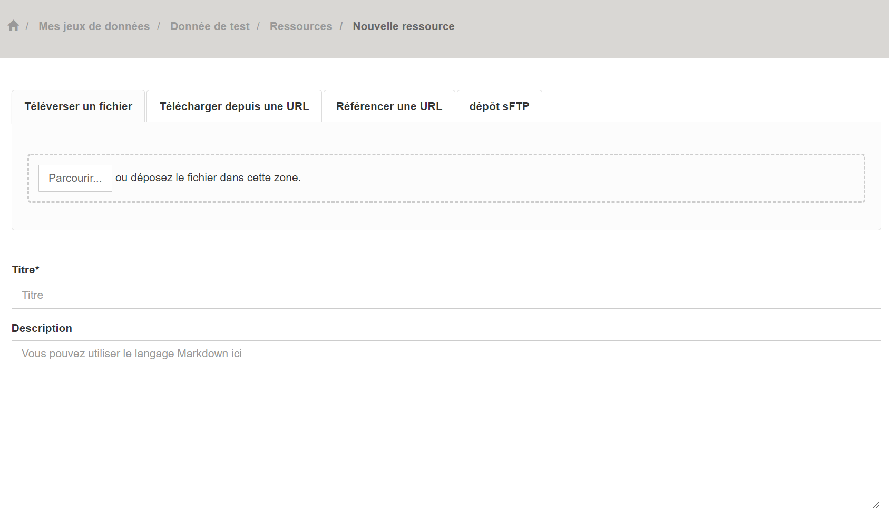

===================
Application Portail - IDG OPenIG
===================

-------------------------------------------------------
Espace consultation
-------------------------------------------------------

OPenIG est un catalogue ouvert à tous :
https://ckan.openig.org/dataset

Les consultations des données ouvertes, géographiques et intelligentes sont libres sur OPenIG. Vous pouvez parcourir le catalogue, rechercher des jeux de données et télécharger des ressources dans différents format de fichier.

Ceci ne concerne pas les données diffusées sur accès restreint, pour lesquelles les producteurs ont volontairement limité leur téléchargement à certains utilisateurs. Toutefois ces jeux de données apparaissent au catalogue général pour porter à connaissance des publics l'existence de ces données. Pour les consulter il faut en faire la demande directement au producteur.

^^^^^^^^^^^^^^^^^^^^^^^^^^^^^^^^^^
Rechercher des données sur OPenIG
^^^^^^^^^^^^^^^^^^^^^^^^^^^^^^^^^^

Pour de meilleurs résultats, OPenIG permet de filtrer les données, d'effectuer des recherches par thématique, selon la fréquence de mise à jour, par format ou uniquement les jeux de données associés à une organisation.

L’ensemble de ces filtres peuvent être cumulés pour affiner les résultats avec un moteur de recherche “textuel”.

- *Catalogue de données OPenIG* https://ckan.openig.org/dataset
- *Liste des organisations OPenIG* https://ckan.openig.org/organization
- *Liste des thématiques OPenIG* https://ckan.openig.org/group
- *Liste des réutilisations recensées à partir des données publiées d'OPenIG* https://ckan.openig.org/showcase

Il n'y a pas d'inscription préalable pour accéder aux jeux de données et aux ressources diffusés en Open Data.

Dans le respect des conditions générales d’utilisation d'OPenIG, chaque jeux de données est publié avec une licence ( licences ouvertes, licence odbl, etc...), choisie par le producteur de la donnée, dans le but de définir les conditions de leur réutilisation.

`Voir le passage sur le Cadre légal et réglementaire <https://openig.readthedocs.io/fr/latest/cadre_legal.html#>`_

Si vous recherchez un jeu de donnée qui ne figure pas au catalogue d'OPenIG, vous pouvez nous solliciter à l'adresse contact@openig.org. Toute demande sera étudiée et une réponse vous sera apportée. Nous relayerons le cas échéant votre demande à la collectivité ou à l'organisme concerné.

`Voir le passage sur la demande de documents administratif <https://openig.readthedocs.io/fr/latest/cadre_legal.html#faire-une-demande-d-acces-a-un-document-administratif-ou-a-des-donnees>`_

-------------------------------------------------------
Espace utilisateurs
-------------------------------------------------------

S'il n'est pas nécessaire de s'inscrire sur la plateforme pour consulter le catalogue et télécharger des données ouvertes, le fait de s'enregistrer sur `OPenIG <https://idgo.openig.org//>`_   permet de disposer des fonctionnalités complémentaires par rapport à la consultation sans inscription.

.. note:: Toute personne, morale ou physique, publique ou privée, peut s'inscrire sur OPenIG et ainsi contribuer à l'ouverture et la mise en commun des données publiques ou privées, en publiant des jeux de données, des textes, des ressources et des commentaires.

^^^^^^^^^^^^^^^^^^^^^^^^^^^^^^^^^^
S'inscrire sur OPenIG
^^^^^^^^^^^^^^^^^^^^^^^^^^^^^^^^^^

- L'utilisateur enregistre son identité qui est distincte de la personne morale qu'il représente.
- En s’inscrivant, l’Utilisateur crée un profil sur la Plateforme.
- En s'inscrivant, l'Utilisateur accepte les `conditions d’utilisation. <https://www.openig.org/mentions-legales/>`_

 .. note:: *Le nom d'utilisateur doit contenir uniquement des caractères alphanumériques en minuscules (ascii) et ces symboles : -_*

.. image:: img/OPenIGInscription.png

- l'Utilisateur doit ensuite valider son inscription en cliquant sur le lien reçu par courriel, sur sa boite aux lettres de courrier électronique.

^^^^^^^^^^^^^^^^^^^^^^^^^^^^^^^^^^
Participer à OPenIG
^^^^^^^^^^^^^^^^^^^^^^^^^^^^^^^^^^

De nombreuses fonctionnalités participatives sont proposées :

- Contacter directement le producteur ou le diffuseur d'un jeu de données.
- Suivre/s’abonner à un jeu de données, une thématique ou une organisation.

- Demander l'accès aux administrateurs à des données avec accès restreint.
- Accéder aux données et services autorisés pour une organisation.
- Partager un jeu de données ou une ressource sur un autre site ou via des réseaux sociaux.
- Déclarer une réutilisation : https://ckan.openig.org/showcase/new

- Participer au contrôle de la qualité d'OPenIG en signalant les contenus n’ayant pas vocation à y figurer (illicites ou contraires aux CGU).

- Créer une nouvelle Organisation ou demander à être rattaché à une Organisation existante (voir rubrique dédiée),
- Demander à devenir contributeur d’une organisation et éventuellement référent d’une organisation pour maitriser l'ensemble des publications de ladite organisation (voir rubrique dédiée).
- Accéder à certaines fonctionnalités de l'API nécessitant une clé d'authentification.
- Intégrer un catalogue de données en marque Blanche sur son propre site internet (Voir rubrique dédiée sur la marque blanche)

-------------------------------------------------------
Espace contributeurs
-------------------------------------------------------

Ce guide est destiné aux producteurs de données, déjà inscrit en tant qu'Utilisateurs et souhaitant contribuer à l'enrichissement des publications sur la plateforme `(voir la documentation sur les Utilisateurs). <https://openig.readthedocs.io/fr/latest/utilisateurs.html>`_

.. note:: Toute personne, morale ou physique, publique ou privée, producteur de données publiques ou privées peut les publier sur OPenIG, sous reserve d'accepter les conditions d’utilisation et de respecter la réglementation sur les données à caractères personnelles.

^^^^^^^^^^^^^^^^^^^^^^^^^^^^^^^^^^
Devenir Contributeur et Référent pour une organisation
^^^^^^^^^^^^^^^^^^^^^^^^^^^^^^^^^^

Les organisations sont le plus souvent des personnes morales (autorités administratives, associations, entreprises) ou également des groupes informels.

.. note:: La création d'une nouvelle organisation peut-être effectuée soit au moment de votre inscription comme utilisateur d'OPenIG, soit après la validation de votre profil Utilisateur par les Administrateurs d'OPenIG. Les demandes de statut de Contributeur ou de Référent sont soumises à la validation des Administrateurs. Il faut donc patienter un peu !

.. note:: Par défaut, un Utilisateur qui s'inscrit avec un **email personnel** (gmail, ymail, hotmail,...) et dont le **nom de domaine ne peut correspondre à l'organisation pour laquelle il demande de contribuer**, ne peut se rattacher, contribuer ou devenir référent d'une Organisation.

*Les Administrateurs de la Plateforme se réservent la possibilité de révoquer une inscription, une organisation, un statut de Contributeur ou de Référent, sans avis préalable.*

**Un Contributeur dispose des fonctionnalités suivantes :**

* Il peut publier un jeu de données et y ajouter des ressources, sous la forme d’un fichier téléchargeable, d’un lien URL ou d’une API.
* Il peut accorder le niveau d'accès aux ressources et jeux de données qu'il a crée pour son organisation : soit décider de les rendre accessible à tous, soit en restreindre l'accès uniquement à un ou plusieurs Utilisateurs inscrits ou bien à une Organisation choisie comme sa propre organisation propriétaire du jeu de données.

**Un Référent des données de l'Organisation, à laquelle il appartient, dispose des fonctionnalités suivantes :**

* Il peut éditer ou supprimer un jeu de données créé et publié par un autre Contributeur de l'Organisation.
* Il peut accorder le niveau d'accès aux ressources et jeux de données de toutes les publications de son Organisation.
* Il peut autoriser ou supprimer le statut de Contributeur aux Utilisateurs.
* Il recoit des notifications lorsque des modifications ont été apportées aux jeux de données et ressources de l'Organisation à laquelle il appartient.

^^^^^^^^^^^^^^^^^^^^^^^^^^^^^^^^^^
Créer une Organisation
^^^^^^^^^^^^^^^^^^^^^^^^^^^^^^^^^^

Toute demande de création d'une organisation est soumise à l'administrateur du site pour validation.

.. image:: img/Creation_orga1_openig.png

La dénomination sociale est obligatoire. Concernant la description, elle est facultative mais fortement conseillée, d'une part pour permettre de qualifier l'Organisation et sa démarche en matière d'ouverture des données publiques et géographiques et d'autre part pour permettre l'implémentation automatique d'une page web spécifique à propos de l'organisation.

^^^^^^^^^^^^^^^^^^^^^^^^^^^^^^^^^^
Editer la page d'une Organisation
^^^^^^^^^^^^^^^^^^^^^^^^^^^^^^^^^^

Pour éditer la page de son organisation, le Contributeur clique sur l'onglet ORGANISATIONS dans son espace d'administration.

La première fois que le contributeur édite la page de son organisation, il lui sera demandé de définir le territoire de compétence de l'organisation. La création de ce territoire de compétences permet de bénéficier de fonctionnalités spatiales supplémentaires dans OPenIG. Cette demande est traitée par un administrateur de la plateforme.

^^^^^^^^^^^^^^^^^^^^^^^^^^^^^^^^^^
Publier un jeu de données
^^^^^^^^^^^^^^^^^^^^^^^^^^^^^^^^^^

* Pour publier un jeu de donner le Contributeur se connecte avec son identifiant et mot de passe sur https://idgo.openig.org

**La publication se fait en deux étapes successives :**

Tout d'abord on renseigne les métadonnées servant à définir ou décrire le jeu de données qui sera publié, puis on ajoute des jeux de données brutes ou des ressources complémentaires.

"""""""""""""""""""""""""""""""""""""""""
Etape n°1 : Renseigner les métadonnées
"""""""""""""""""""""""""""""""""""""""""

**1.	Métadonnées simplifiées**

.. note:: De nombreux mots-clés sont déjà répertoriés dans la base. Ils apparaissent dans une liste déroulante lorsque vous saisissez les premières lettres du mot. Mieux vaut choisir un mot clé existant, plutot que d'en choisir un nouveau afin de permettre de relier votre jeu de donnée à d'autres jeux similaires inscrits au catalogue d'OPenIG.

**Les métadonnées obligatoires sont les suivantes :**

- Titre
- Organisation à laquelle est rattaché ce jeu de données
- Descriptif  : C'est un champ incontournable pour garantir une bonne réutilisation, car une donnée bien décrite est une donnée bien réutilisée !
- Dates de création, de dernière modification et de publication : la valeur par défaut indique la date du jour et la date de modification se met à jour automatiquement lorsque vous enregistrez des modifications sur les ressources.
- Licence : Selectionner une licence parmi celles qui sont proposées: Licence APLC; Creative Commons (Attribution); Creative Commons (Attribution Share-Alike); Creative Commons (CCZERO); Licence ouverte V2.0; Open Data Commons (Attribution); Open Data Commons (ODbL) ou une autre Licence (Ouverte ou Spécifique).

**2.	Métadonnées INSPIRE**

Pour pouvoir compléter les métadonnées INSPIRE, il faut sélectionner le jeu de données et choisir "Editer la fiche de métadonnées INSPIRE".

Tous les champs à compléter pour respecter la norme INSPIRE seront regroupés dans des rubriques : Auteurs et contacts pour la fiche de métadonnées; description des données; contacts pour la base de données; références géographiques et qualité des données; conditions légales d'accès et d'usage; ressources associées.

"""""""""""""""""""""""""""""""""""""""""
Etape n°2 : Publier une ressource
"""""""""""""""""""""""""""""""""""""""""

Il existe quatre manières différentes d'ajouter un jeu de données :

**1.	Téléverser manuellement un fichier depuis votre poste local :**

A l'aide du bouton Parcourir, vous pouvez déposer le fichier qui s’ajoute dans l’entrepôt de données d'OPenIG.

Le **Titre** de votre fichier est automatiquement recopié, mais il est possible de modifier manuellement le nommage de ce jeu de donnée. Le format du fichier est automatiquement reconnu par IDGO mais **attention** :

.. note:: Si vous publiez un **Shapefile zippé**, il faut choisir le format **"ESRI Shapefile (Fichier ZIP)"** et non pas "ZIP".

Il faut préciser si le jeu de donnée est disponible en tant que Données brutes ou si c'est une documentation associée au jeu de données pour permettre aux visiteurs d'OPenIG d'avoir des informations complémentaires (plaquettes de communication, affiches, photographie, site internet....).

**2.	Télécharger un jeu de donnée depuis une URL de téléchargement :**

Dans ce cas, IDGO va télécharger la ressource pour l'ajouter dans l’entrepôt de données.

Ce mode de publication permet de synchroniser la ressource distante, selon une périodicité régulière à indiquer :

* Jamais
* Quotidienne (tous les jours à minuit)
* Hebdomadaire (tous les lundis)
* Bimensuelle (1er et 15 de chaque mois)
* Trimestrielle ( 1er des mois de Janvier, Avril, Juillet et  Octobre)
* Annuelle (1er Janvier)

Par exemple, un fichier transport.zip peut-être synchronisé sur OPenIG directement grace à son URL de téléchargement.

.. note:: Quelques précautions à prendre pour que la synchronisation s'active correctement :

  * le nom de votre fichier doit avoir **exactement** le même nommage de fichier pour toute la synchronisation : si un script modifie le nom du fichier (pour rajouter une date ou autre par exemple), la synchronisation ne fonctionnera pas.

  * votre fichier doit être accessible via une URL fixe : évitez les liens temporaires.::

En cas d'erreur, les administrateurs d'OPenIG se chargeront de vous indiquer que la synchronisation ne fonctionne pas ou plus.

**3.	Référencer une URL :**

Dans ce cas, la ressource n'est pas téléchargée dans OPenIG et vous indiquez précisement l'adresse URL de téléchargement de la donnée qui reste hebergée chez son producteur.
Cette donnée apparait au catalogue d'OPenIG mais elle n'est pas hébergée dans son entrepot.

.. image:: img/Upload_ressources_ref_URL_OPenIG.PNG

**4.	Dépot FTP :**

Il faut se connecter au sFTP avec son logiciel (ex: FileZilla, voir photo ci-dessous) à l'adresse donnée et avec ses identifiants OPenIG.

.. hint::
  Dans FileZilla, ajouter un site dans "Gestionnaire de site" avec les paramètres suivants :
    - Protocole : sFTP
    - Hôte : sftp.openig.org
    - Port : 8322
    - Identifiant : vos identifiants OPenIG

.. image:: img/depot_FTP_Filezilla.PNG

Les fichiers qui se trouvent sur le compte sFTP apparaîtront dans la liste déroulante. Ce mode de publication permet de synchroniser la ressource, selon une périodicité régulière à indiquer.

.. note:: Il peut arriver que la connexion au serveur FTP ne fonctionne pas lorsque le Proxy de votre organisation bloque l’accès au compte FTP; Veuillez pour cela tester la connexion à partir d’un autre point d’accès internet sans Proxy (depuis un smartphone ou une connexion internet personnelle).

"""""""""""""""""""""""""""""""""""""""""
Styliser une couche
"""""""""""""""""""""""""""""""""""""""""

Pour créer un style pour un jeu de donnée, il faut le sélectionner et "éditer les ressources associées".

.. image:: img/style_OPenIG.png

Il faut ensuite sélectionner la ressource à styliser du jeu de données et cliquer sur "editer".

.. image:: img/editer_donnes_OPenIG.png

Puis cliquer sur "éditer la ressource géographique" lorsqu'on est sur la page de la ressource.

Enfin il faudra choisir l'onglet "Styles" à droite de "Configuration générale".

**Créer un style manuellement**

Manuellement et directement dans l'interface, il est possible de donner un nom pour le style et la classe ainsi que de créer :

* Des filtres
* Des représentations (couleur et opacité du fond et couleur et épaisseur du contour)
* Des étiquettes

A noter que l'utilisateur a, pour tous les styles importés ou créés dans cette interface, la possibilité de les exporter directement en SLD.

**Créer un style avec un SLD**

Il est possible d'importer un SLD créé au préalable pour la ressource. Il suffit de cliquer sur "Importer un SLD" en haut à droite de la fenêtre de style et de coller le fichier SLD.

Enfin enregistrez votre style.

.. image:: img/style2_sld_OPenIG.PNG

^^^^^^^^^^^^^^^^^^^^^^^^^^^^^^^^^^
Mettre à jour un jeu de données ou une ressource
^^^^^^^^^^^^^^^^^^^^^^^^^^^^^^^^^^

Les données publiées peuvent être mises à jour après leur publication, que la modification porte sur un jeu données dans son ensemble, ou sur l’une des ressources qu’il contient (Données brutes ou ressources associées).

L’actualisation d’une ressource existante permet d’en mettre à jour le contenu sans changer l’emplacement qui lui est assigné, c’est-à-dire son lien hypertexte (aussi appelé URL). Le fait d’actualiser une ressource (plutôt que de la supprimer et d’en créer ensuite une nouvelle) permet de conserver l’historique des téléchargements de cette ressource. Cela évite aussi de créer des liens rompus sur Internet, qui meneront à une erreur HTTP 404, vu que la page web n’existera plus et sera introuvable par le serveur.

^^^^^^^^^^^^^^^^^^^^^^^^^^^^^^^^^^
Supprimer un ensemble de donnée et / ou une ressource
^^^^^^^^^^^^^^^^^^^^^^^^^^^^^^^^^^

Aller sur le site https://idgo.openig.org et rechercher vos jeux de données.

Il est possible de supprimer un ensemble de données (Dataset) comprenant les metadonnées; ou seulement les ressources et fichiers brutes associés à un ensemble de données. Pour cela, il faut sélectionner l’ensemble de données que vous souhaitez supprimer.

.. image:: img/Supp_donnees_OPenIG.PNG

Attention, cette action est irréversible et supprimera définitivement le jeu de données ainsi que toutes les ressources qui lui sont attachées.

^^^^^^^^^^^^^^^^^^^^^^^^^^^^^^^^^^
Valoriser un ensemble de données en indexant leur réutilisation
^^^^^^^^^^^^^^^^^^^^^^^^^^^^^^^^^^

La fonctionnalité "réutilisation" (Trouver des données -> Réutilisation) permet d'indexer les applications/projets existants et réutilisants des données issues du catalogue d'OPenIG. Vous pouvez visualiser celles existantes sur cette page.

Lorsqu'une donnée est réutilisée, nous vous invitions à créer une "réutilisation" afin de valoriser vos projets et/ou vos données . Pour en créer une, il vous suffit de cliquer sur "Ajouter une réutilisation" et de remplir le formulaire.

La réutilisation sera aussi visible sur la page du jeu de données :

^^^^^^^^^^^^^^^^^^^^^^^^^^^^^^^^^^
Datastore et données intelligentes
^^^^^^^^^^^^^^^^^^^^^^^^^^^^^^^^^^

OPenIG propose un **datastore**, c'est à dire un entrepôt de données qui offre des **services dits "intelligents" sur les données tabulaires aux formats CSV, XLSX, XLS, GeoJSON & JSON**.

La publication des données sur OPenIG, dans un format ouvert et interprétable par une machine, permet leur indexation dans le datastore afin notamment de proposer des aperçus, de les filtrer par champs et de les parcourir sans utiliser de tableur dédiés.

Le format CSV est le format pivot à privilégier pour transformer vos données tabulaires en données semi-structurées dites "intelligentes" afin que le datastore génère des datavisualisations simples sous forme de grille, de graphe ou de carte.

Des données intelligentes permettent également d'en automatiser l'accès par API ( Application Programming Interface) :
L'accessibilité des données par interface de programmation est une condition nécessaire pour massifier et industrialiser les usages qui peuvent être fait de ces dernières.
Les données indexées dans le datastore sont ensuite "requetables" directement à travers l'API à travers une série de fonctionnalités puissantes.
( voir la présentation de l'API CKan : https://openig.readthedocs.io/fr/latest/developpeurs/index.html#service-api-ckan)

""""""""""""""""""""""""""""""""""""""""""""""""""
Préparation des données tabulaires pour indexation dans Datastore
""""""""""""""""""""""""""""""""""""""""""""""""""

**Vos jeux de données doivent être préparés pour être proprement indexés dans le datastore :**

* Dans CKAN, le format CSV doit être privilégié avec une , comme séparateur / délimiteur.
* Idéalement, passez tous vos jeux de données en UTF-8. Pour cela le programme Notepad++ fait cela très bien.
* Idéalement, exportez vos tableurs favoris (Microsoft, Libre et Open Office) au format CSV.
* Restreindre vos titres de colonnes à moins de 62 caractères.
* Ne pas doublonner le titre d'une colonne.
* En théorie les caractères spéciaux ('\:.,( -') sont acceptés, mais c'est beaucoup mieux de les éviter dans les titres.
* Harmoniser le type de vos données (et oui vos données sont typées!) : en effet si une colonne ne comporte que des chiffres, le datastore autodéterminera le type de cette colonne comme étant un nombre. Or il suffit qu'une cellule de la colonne contienne l'entrée N/A, pour que le datastore génére une erreur.
* La taille limite des données pouvant être exploitées via l'API est de **15MO**.
Pour éviter les erreurs de type, il est préférable de les corriger avant d'indexer le jeu de donnée dans OPenIG ou bien de transformer la valeur des cellules en cellules au format TEXTE. Cela n'est pas satisfaisant, mais ça fonctionne.

* ERREUR : En cas d'erreur supprimez complètement la ressource associée au jeu de données et ajoutez en une nouvelle.

.. Note:: **Attention avec Excel :**

  * lorque le fichier contient plusieurs feuillet (ou onglet), seule la dernière feuille de calcul est indexée dans le datastore. Il est donc nécessaire de déplacer la feuille de calcul contenant les données que vous souhaitez indexer dans le datastore en dernière place de votre tableur.

  * si vous ne voulez pas indexer vos données dans le datastore (pour plein de bonnes et mauvaises raisons), il suffit d'ajouter une feuille de calcul vide en dernière place de votre tableur. ::

""""""""""""""""""""""""""""""""""""""""""""""""""
Géolocalisation et visualisation des données indexées
""""""""""""""""""""""""""""""""""""""""""""""""""

Une carte peut automatiquement être générée à partir de vos données tabulaires geolocalisées. Pour cela, il faut renseigner les coordonnées géographiques soit avec un champ GeoJSON soit avec deux colonnes distinctes : "latitude" et "longitude". Attention, la projection utilisée est le WGS84 (EPSG : 4326).

L’option « Marqueurs de regroupement » vous permet de « fusionner » visuellement les données proches.

Un graphique peut également être généré en sélectionnant les colonnes à assigner aux axes ainsi que le type de graphique parmis la liste disponible. Il est possible de combiner plusieurs "séries" au sein d'un même graphique.

^^^^^^^^^^^^^^^^^^^^^^^^^^^^^^^^^^
Service WMS et WFS
^^^^^^^^^^^^^^^^^^^^^^^^^^^^^^^^^^

Pour accéder aux flux OGC (Web Map Service et Web Feature Service) des données publiées sur OPenIG, il existe plusieurs façons selon le type de service :

**1. Flux Mapserver**

Lorsqu'on se situe sur la fiche d'un jeu de données, il suffit de cliquer soit directement sur la ressource soit sur l'oeil.

.. image:: img/acces_flux.png

Il faut ensuite sélectionner "API Géo".

.. image:: img/API_geo.png

.. note:: Si le bouton "API Géo" ou l'aperçu cartographique n'apparaît pas, cela peut provenir du fait que la ressource géographique déposée n'a pas été reconnue comme telle. Cela est souvent dû au format choisi lors de la publication de la ressource. Attention, pour un Shapefile zippé il faut choisir le format "ESRI Shapefile (Fichier ZIP)"" et non pas "ZIP".

.. image:: img/Shapefile_zip.PNG

Une fois que vous avez cliqué, un menu contextuel apparait pour vous donner toutes les informations que vous souhaitez.

.. image:: img/API_geo2.png

Pour une utilisation dans QGIS, il suffit d'ajouter une nouvelle connexion WMS ou WFS en collant l'URL suivante :
 "https://mapserver.openig.org/maps/" + l'identifiant de l'organisation

L'identifiant d'une organisation peut être facilement récupérer :

* Se rendre sur la page : https://ckan.openig.org/organization
* Sélectionner l'organisation
* Récupérer l'identifiant à la suite de l'URL : https://ckan.openig.org/organization/region-occitanie-pyrenees-mediterranee --> "region-occitanie-pyrenees-mediterranee"

Exemple 1 : departement-du-gard -> https://mapserver.openig.org/maps/departement-du-gard

Example 2 : departement-des-pyrenees-orientales -> https://mapserver.openig.org/maps/departement-des-pyrenees-orientales

**2. Flux Mapcache**

Réservés aux adhérents, ce flux permet d'accéder aux orthophotographies et certains fonds IGN. Cela nécessite d’avoir un compte sur openig.org pour les consommer.

Depuis votre SIG il faut renseigner l’adresse suivante  https://mapserver.openig.org/mapcache/ ainsi que vos identifiants et mot de passe utilisés pour vous connecter à https://www.openig.org/.

Les couches sont visibles à partir de l’échelle 1:250’000.

Le tuilage des couches n’est pas pré-calculé ; il est calculé à l’affichage. C’est pourquoi on peut rencontrer des lenteurs lors des premières utilisations. Les performances s’amélioreront progressivement à l’usage.

Liste des couches disponibles :

.. image:: img/flux_mapcache.png

En plus de cette documentation, des **tutoriels vidéos** existent sur le site internet d'OPenIG (service accessible uniquement aux adhérents) : https://www.openig.org/flux

^^^^^^^^^^^^^^^^^^^^^^^^^^^^^^^^^^
Faire remonter vos données sur Data.Gouv.fr
^^^^^^^^^^^^^^^^^^^^^^^^^^^^^^^^^^

OPenIG et Etalab ont travaillé ensemble afin de permettre aux contributeurs d'OPenIG de faire remonter automatiquement leurs catalogues de données vers la plateforme nationale https://www.data.gouv.fr/fr/. Cette mécanique est aussi appelée "moissonneur" ou "passerelle".

La procédure est relativemment simple. Il suffit de la mettre en place une fois pour que le catalogue de données d'OPenIG concerné soit ensuite synchronisé quotidiennement sur DataGouv.

**Chaque contributeur et organisation reste souverain pour mettre en place ou non une synchronisation de ses données vers DataGouv.**

**Quelques précisions :**

- Seules les **métadonnées** sont synchronisées sur DataGouv. Les données restent sur OPenIG (ou ailleurs en fonction de vos choix en matière d'indexation de ressources).
- Le moissonneur ne prend pas en compte la **suppression** de jeux de données. Chaque contributeur doit supprimer ses jeux de données directement sur DataGouv.
- Un compte organisation sur DataGouv expose indifféremment les jeux de données créés manuellement sur DataGouv et les jeux de données synchronisés automatiquement depuis OPenIG. Attention aux doublons et à la cohérence des jeux de données.

**Mise en place de la procédure :**

**ETAPE 1:** Chaque contributeur crée une organisation sur DataGouv avec un compte utilisateur en son nom. `« INSCRIPTION sur DataGouv » <https://www.data.gouv.fr/fr/login?next=https%3A%2F%2Fwww.data.gouv.fr%2Ffr%2F>`_
- Ce compte utilisateur doit être adminsitrateur de l'organisation.

**ETAPE 2: création d'un point de moissonnage sur DataGouv** L'administrateur de l'organisation sur Data.gouv.fr doit déclarer un point de moissonnage depuis l’interface d’administration DataGouv.

- En haut à droite de votre espace d'administration DataGouv, cliquez sur plus, puis AJOUTER un MOISSONNEUR.

- Choisissez "Publier en tant qu’organisation", cliquez sur SUIVANT.

- C'est ensuite ici que vous renseignez les informations techniques de votre moissonneur.
- **TITRE**: Il convient d'ajouter "- OPenIG" à votre titre afin de l'identifier plus facilement.
- **URL :** https://ckan.openig.org/dataset
- **IMPLEMENTATION : CKAN**
- Il est TRES important de ne pas oublier d'ajouter un filtre, au risque de moissonner tout OPenIG.
- **FILTRES -> INCLURE -> Organisation : ajouter l'identifiant de votre organisation dans OPenIG.** ( il s'agit de l'url de votre organisation sur OPenIG)
Exemple 1 : https://ckan.openig.org/organization/departement-du-gard -> Identifiant du département du Gard

Example 2 : https://ckan.openig.org/organization/departement-des-pyrenees-orientales -> identifiant du département des Pyrénées Orientales

- Cochez la case **ACTIF**.
- Cliquez sur **ENREGISTRER.**

**ETAPE 3:** Une fois créé, chaque contributeur **déclare son moissonneur aux administrateurs d'OPenIG en écrivant à contact@openig.org**.

**ETAPE 4:** Etalab valide le moissonneur à la demande des administrateurs d'OPenIG.

**ETAPE 5:** La synchronisation du catalogue distant est faite une fois par jour (chaque nuit).
