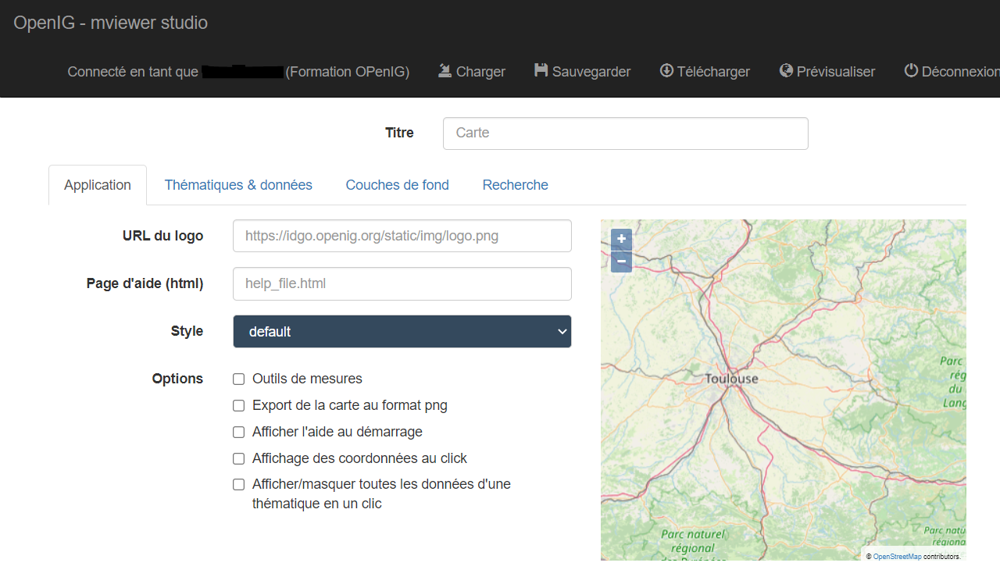
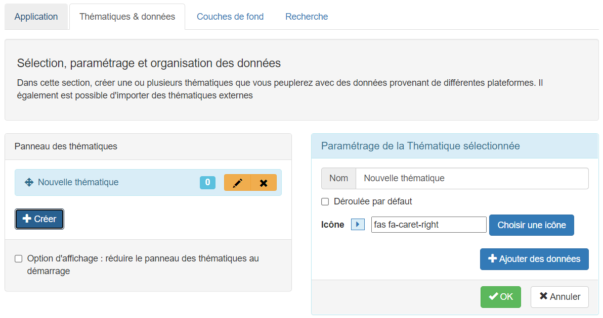
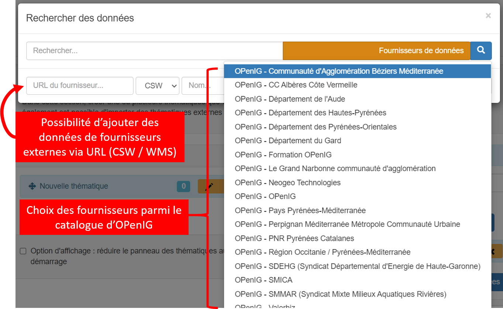
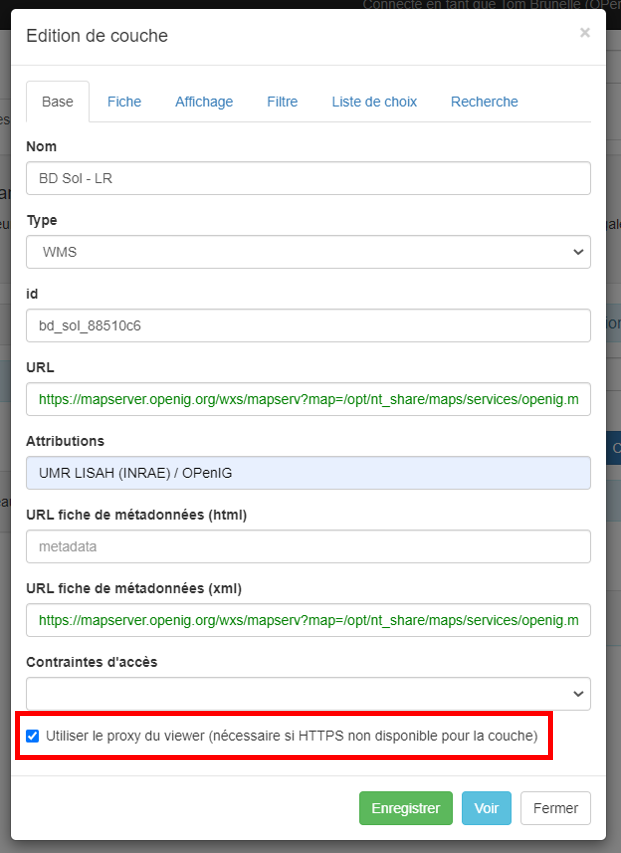
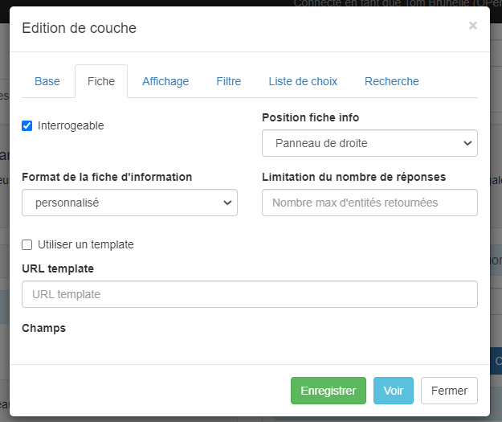
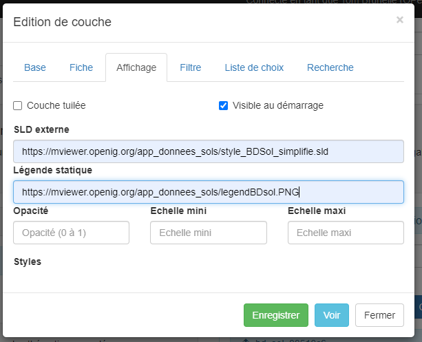
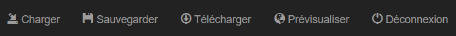

====================
Application MViewer - Valoriser ses données
====================

Ce service est uniquement accessible aux **adhérents** d'OPenIG afin de créer ses propres cartes.

Il faut vous rendre sur le site internet d'OPenIG, vous authentifier et accéder à la page "créer sa carte" via la rubrique "services avancés" de l'onglet "Accès rapides".
Sinon directement via cette URL : https://www.openig.org/creer-sa-carte

Via cette page, vous avez accès au MViewer Studio :

.. Attention:: L'outil MViewer a été développé avec le serveur cartographique GeoServer. OPenIG utilisant MapServer, certaines fonctionnalités ne sont pas disponibles. La plupart des paramétrages pourra se faire mais via des fichiers externes stockés sur serveur et non pas directement avec l'interface Studio.

**Onglet Application :**

Spécification des paramètres globaux de l'application (emprise géographique, titre, couleur, etc.). Pour pouvoir utiliser une page d'aide ainsi qu'un logo spécifique, ceux-ci doivent être déposés sur un serveur. Il suffira ici de renseigner l'adresse URL de ces fichiers.

Exemple de page d'aide .HTML de base::

    <ul class="nav nav-tabs" role="tablist">
        <li role="presentation" class="active"><a href="#h_app" aria-controls="profile" role="tab" data-toggle="tab">Application</a></li>
        <li role="presentation" ><a href="#h_credits" aria-controls="settings" role="tab" data-toggle="tab" i18n="help.modal.credits">Crédits</a></li>
    </ul>
    <!-- Tab panes -->
    

        
<h4 i18n="help.modal.about">A propos de l'application</h4>Application qui présente ...

        
<h4 i18n="help.modal.credits">Crédits </h4>`Application réalisée par ... 

    

**Onglet Thématiques & données :**

*Ajout d'une thématique :*

*Ajout d'une donnée :*

*Paramétrage de la donnée :*

.. Attention:: Il ne faut pas oublier de cocher la dernière case ("utiliser le proxy") afin que la couche puisse s'afficher dans le visualiseur.

La rubrique "fiche" va vous permettre de modifier la fiche d'information relative à la ressource lorsque vous allez sélectionner une entité.
Du fait de MapServer, la seule possibilité de paramétrer cette fiche sera d'appeler un fichier .MST stocké sur votre serveur. Si vous souhaitez en savoir plus : https://mviewerdoc.readthedocs.io/fr/latest/doc_tech/config_tpl.html

L'affichage peut se personnaliser mais encore une fois avec des fichiers externes : URL d'un fichier .SLD ou URL d'une image pour la légende.

Les autres rubriques (filtre, choix, recherche) ne sont pas paramétrables dans notre cas.

Enfin, vous allez pouvoir sauvegarder votre application sur le serveur, télécharger le fichier de paramétrage .XML de votre application et prévisualiser l'application définie.
"Charger" vous permettra d'utiliser un fichier .XML stocké en local ou de charger une application sauvegardée sur le serveur.

Liens utiles :

* Github de MViewer : https://github.com/geobretagne/mviewer

* Applications développées par la Région Bretagne : https://mviewer.netlify.app/fr/

* La documentation MViewer : https://mviewerdoc.readthedocs.io/fr/latest/index.html
